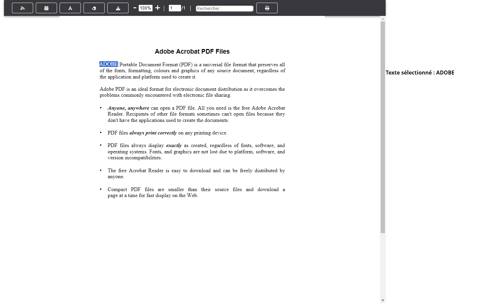
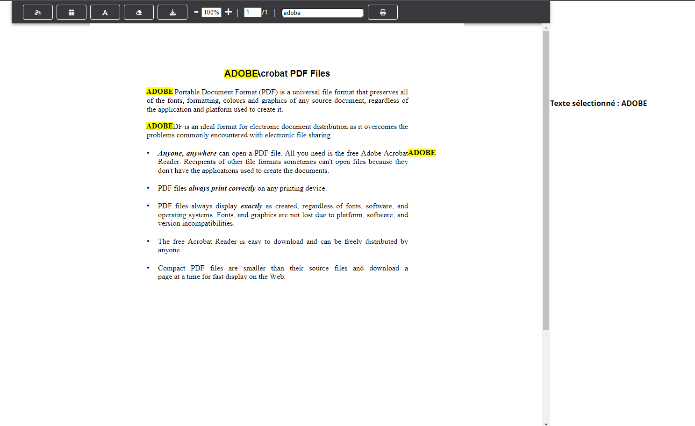

# PDF Viewer with Annotation, Editing, Zoom, Pagination, and Rotation Features

The PDF Viewer with Annotation, Editing, Zoom, Pagination, and Rotation Features is a comprehensive application for viewing, annotating, editing, zooming, paginating, rotating, downloading, and printing PDF files. This application offers you a suite of tools to interact with your PDF documents efficiently and conveniently.

## Key Features

- **Text Capture**: Capture important text excerpts from your PDF documents to highlight or save.

- **Text Search**: Quickly search for specific words or phrases within your extensive PDF files.

- **Signature Addition**: Electronically sign your documents by adding customized signatures with just a few clicks.

- **Date Stamp**: Add the current date to your PDFs for organized file management.

- **Text Addition**: Easily insert additional text into your PDFs to provide comments, notes, or contextual information.

- **PDF Editing**: Modify the content of your PDF files by adding, removing, or editing text and images.

- **Zoom**: Adjust the zoom level to view your PDFs in greater detail or overview.

- **Pagination**: Navigate through multi-page PDFs conveniently using pagination controls.

- **Rotation**: Rotate pages in your PDFs to better suit your reading preferences.

- **Download**: Download your annotated and edited PDFs to save locally or share with others.

- **Printing**: Print your PDFs with annotations and modifications directly to have a physical copy.

## Screenshots

## How to Use

1. Clone this repository to your local machine.
2. Open the application and load the PDF file of your choice.
3. Use the annotation, editing, zoom, pagination, and rotation icons in the toolbar as needed.
4. Changes can be saved to a new PDF file, downloaded, or directly printed.

## System Requirements

- Operating System [list of compatible operating systems]
- [Other software dependency, if applicable]

## Installation

1. **Clone the Repository**: Clone this repository to your local machine using the following command:
2. **Navigate to the Project Directory**: Use the terminal or command prompt to navigate to the directory where you cloned the repository:
3. **Install Dependencies**: Use npm to install the project's dependencies by running the following command: npm install
4. **Run the Application**: Once the dependencies are installed, you can start the application by running: npm start
This command will launch the PDF Viewer application in your default web browser.
5. **Access the Application**: Open your web browser and go to `http://localhost:3000` to access the PDF Viewer with all its features.

Please make sure you have Node.js and npm installed on your system before proceeding with the installation. You can download them from the official Node.js website: https://nodejs.org/

## System Requirements

- Operating System [list of compatible operating systems]
- Node.js and npm installed
- [Other software dependency, if applicable]

## Contributions

## Author
https://github.com/heidet

## License

